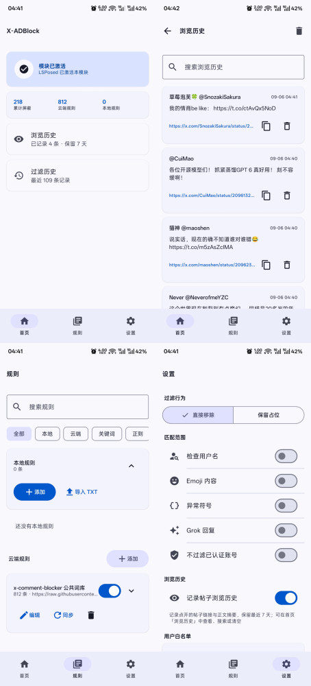

# X-ADBlockModule

一个基于 [LSPosed](https://github.com/LSPosed/LSPosed) 的 X (Twitter) Android 模块，用于屏蔽 X 官方 App 中文区黄色广告与垃圾机器人帖子。**官方商业广告一概不碰**（约定原则）。

> ⚠️ 仅供学习与个人使用。本模块通过逆向分析 X 12.22.0 的渲染结构实现，随版本更新可能失效。
本人能力有限，模块可能（绝对）有bug，也可能更新不及时，有能力的兄弟有空可以帮忙维护一下代码，本项目由deepseekv4flash开发。

## 功能
<p align="center">
  
</p>

- **垃圾帖屏蔽**：命中词库的帖子可整行移除（REMOVE 模式）或保留头像/用户名、正文替换为"[已拦截]"占位（MARK 模式）。
- **只在对话/详情页处理**：主页时间线完全不扫描（entryId 以 `conversationthread-` 开头才进入匹配），保证主页滚动零开销。
- **词库云端同步**：默认订阅 [x-comment-blocker](https://github.com/amahteru/x-comment-blocker) 公共词库（GitHub raw + jsdelivr CDN 兜底，ETag/304 增量同步），支持多订阅增删、本地 TXT 导入。
- **词库格式**：`#` 注释/分类头、`/regex/flags`、纯关键词（匹配时做零宽字符剥离、小写去空白）。
- **过滤选项**：用户名、仅 Emoji 内容、特殊字符、Grok 匹配开关；支持跳过已认证账号，显示模式（占位/移除）可切换。
- **用户白名单**：可在设置中维护，也可从过滤历史直接将发帖用户加入白名单。
- **过滤历史**：记录命中词条、发帖用户、emoji 与异常符号等拦截事件，保留最近 500 条，可在模块界面查看/清空。
- **帖子浏览历史**：每点开一个帖子自动记录链接与正文摘要（含用户名、时间），列表点按即跳回 X（未安装则走浏览器），顶部关键字搜索，同一帖子只保留一条并按最近浏览时间置顶；保留最近 7 天，可删除单条或一键清空，也能在设置里关闭记录。
- **诊断日志**：写入模块私有目录 `files/logs/xadblock_module.log`（模块 App 与 hook 日志合并保存，不再写入公共 Download）；设置页“关于”区域的“导出日志”卡片可通过系统文件选择器导出。

## 技术方案

- **Hook 目标**：X 官方 App `com.twitter.android`（12.22.0）。
- **渲染链路**（详见 [orchestra/reverse-findings-x-12.22.0.md](orchestra/reverse-findings-x-12.22.0.md)）：
  - 列表过滤入口：`com.x.urt.ui.o#c/d`、`com.x.urt.ui.h/j` 构造。
  - 行渲染：`com.x.jetfuel.v2.element.attribute.h#a(...)`（整行包含头像/用户名/正文）。
  - 内容渲染：`com.x.urt.items.post.i5#invoke`；帖子渲染状态 `com.x.urt.items.post.b5`（字段 `a`=entryId、`g`=正文、`i`=displayTextRange）。
  - 浏览历史：`com.x.urt.items.post.y`（FocalPostState）构造，字段 `a` 即被点开帖子的渲染状态（`b`=postId `com.x.models.z5`、`e`=作者 `com.x.models.mh`）；只有详情页焦点帖会进入该状态，列表滚动不会误记。链接按 `com.x.models.s5#getUrl()` 的形状拼装为 `https://x.com/<handle>/status/<id>`，用户名不可信时退回 `https://x.com/i/status/<id>`。
- **跨进程通道**：模块 App 通过 LibXposed Service 的 **Remote Preferences** 写入规则快照，X 进程通过 `XposedInterface.getRemotePreferences()` 读取；事件与 hook 日志回传走 setPackage 广播（`ACTION_BLOCK_EVENTS` / `ACTION_VIEW_EVENTS` / `ACTION_HEARTBEAT` / `ACTION_HOOK_LOGS`）。
- **性能**：关键词匹配用 Aho-Corasick 自动机（编译期构建，一次遍历出所有命中）；entryId 评估缓存避免重复匹配；规则快照变更由心跳线程每 120s 检查一次。
- **构建链**：AGP 8.7.3 / Kotlin 2.0.21 / Gradle 8.11.1 / compileSdk 36 / minSdk 26；LibXposed API 102；Room 走 KSP。

## 构建

```bash
# 1. 准备签名（可选，缺失时 release 自动回退 debug 签名）
cp keystore.properties.example keystore.properties
#    填写你自己的 storeFile/storePassword/keyAlias/keyPassword

# 2. 构建 debug
./gradlew assembleDebug
# Windows: gradlew.bat assembleDebug --no-daemon

# 产物
app/build/outputs/apk/debug/app-debug.apk
```

依赖说明：

- `io.github.libxposed:api:102.0.0` 仅在编译期使用（`compileOnly`），运行时由 LSPosed 框架提供；模块 App 使用 `io.github.libxposed:service:101.0.0` 连接 Service、Provider 与 Remote Preferences。
- `app/src/main/assets/builtin_keywords.txt` 内置词库派生自 [x-comment-blocker](https://github.com/amahteru/x-comment-blocker)（MIT）。

## 安装与使用

1. 安装支持 LibXposed API 102 的 [LSPosed](https://github.com/LSPosed/LSPosed)（需 Root）。
2. 编译并安装本模块 APK，在 LSPosed 中启用模块，作用域勾选 `com.twitter.android`，重启。
3. 打开模块 App：
  - 「首页」：查看 LSPosed 模块激活状态、规则数量和屏蔽统计。
  - 「订阅」：管理云端订阅源，立即同步。
  - 「过滤」：显示模式（占位/移除）、匹配选项开关、Grok。
  - 「本地规则」：导入 TXT 或清空本地规则。
  - 「历史」：查看或清空命中记录。
  - 首页「浏览历史」：查看点开过的帖子，支持搜索、单条删除与一键清空（保留 7 天）。
  - 「设置」底部「关于」：分别显示 GitHub 主页、版本号，并提供日志导出。
4. 点进任意推文查看回复效果。

模块配置由现代元数据声明：`META-INF/xposed/module.prop`、`java_init.list`、`scope.list`。API 102 支持模块热重载；更新模块后，旧代 hook 会先清理，再由新代重新安装。

## 免责声明

- 本模块仅作用于"垃圾机器人/黄色引流"类帖子，**不处理任何官方商业广告**。
- 屏蔽行为基于文本匹配，可能存在误伤；请谨慎使用。
- 本项目与 X Corp. 无关，不提供任何官方保证。

## 许可证

MIT，见 [LICENSE](LICENSE)。

内置词库与默认订阅源来自 [x-comment-blocker](https://github.com/amahteru/x-comment-blocker)（MIT License, Copyright (c) 2026 Ethan Zhou），版权归原作者所有。
